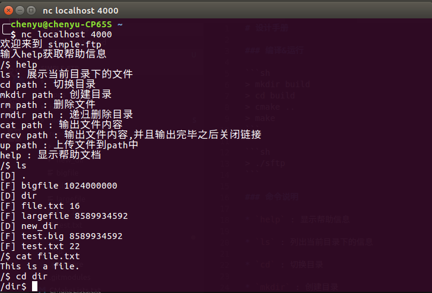
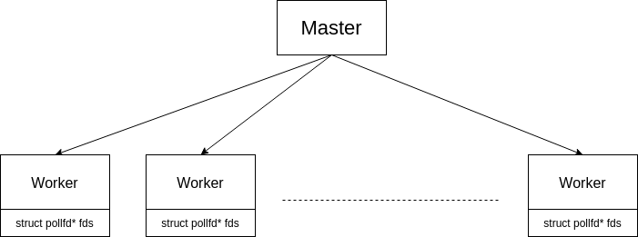
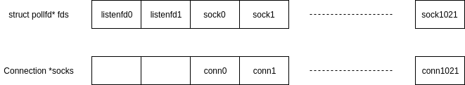
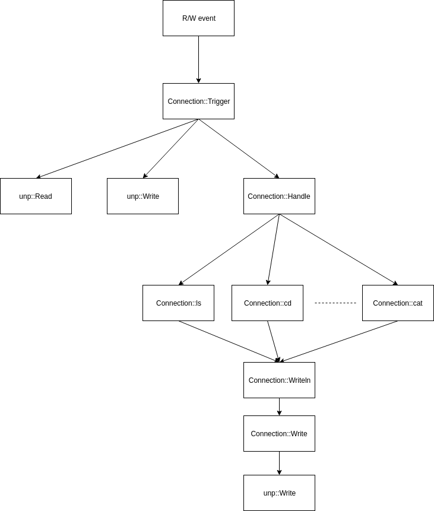
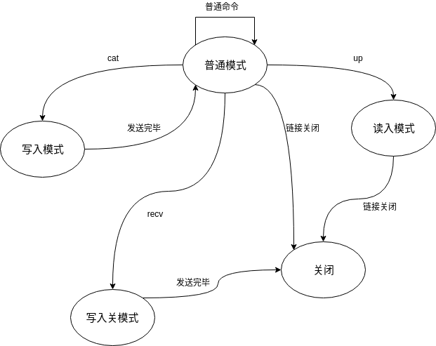

# 设计手册

### 编译&运行

```sh
> mkdir build
> cd build
> cmake ..
> make
```

```sh
> ./sftp
```

### 准备仓库

在当前目录下执行

```sh
> mkdir repo
```

`repo`就是客户端访问到的目录.

### 网络协议

由于这是一个简化版的ftp,所以并没有设计客户端,对客户端的要求仅仅是能够发送和显示TCP数据即可,在linux下可以使用`nc`命令:

```sh
> nc localhost 4000
```

本FTP采用一种类shell的交互方式:用户每次在客户端中输入一行命令(以'\n'结尾),服务器解析该命令并返回响应结果.

具体支持的命令如下:

* `ls` : 展示当前目录下的文件
* `cd path` : 切换目录
* `mkdir path` : 创建目录
* `rm path` : 删除文件
* `rmdir path` : 递归删除目录
* `cat path` : 输出文件内容
* `recv path` : 输出文件内容,并且输出完毕之后关闭链接
* `up path` : 上传文件到path中
* `help` : 显示帮助文档

1. 下载服务器上的`file.txt`到本地`download.txt`

```sh
> echo "recv file.txt" | nc localhost 4001 > download.txt
```

2. 上传本地的`file.txt`到服务器`upload.txt`

```sh
> echo "up upload.txt" | cat - file.txt | nc localhost 4001
```

### 运行截图



### 源代码文件说明

* `src/server.h/cpp` : 服务器类

* `src/connection.h/cpp` : 对于每个链接会设置一个`class Connection`对象,用于处理用户的请求

* `src/tools.h/cpp` : 相关工具函数,封装了一些与具体磁盘操作的函数

* `app/sftp.cpp` : `sftp`的主函数

### 服务器架构

服务器采用Master/Worker+poll模型.

在Master进程中,首先会监听`4000`和`4001`端口,得到两个监听描述符`listenfd0`和`listenfd1`.
然后会通过调用`fork`创建`8`个Worker进程,同时将`listenfd0`和`listenfd1`传递给Worker.

Worker进程会申请`1024`个`pollfd`的空间(`struct pollfd* fds`),将`listenfd0`和`listenfd1`放在空间的前`2`个位置.
然后通过`poll`监听是否有新的连接到来,并将到来的链接放在后`1022`个空间中.

理论上服务器能够支持的最大并发数为`8*(1024-2)=8176`个.



Master进程会监听Worker进程的退出情况,在Worker进程异常退出(Worker进程正常情况下不会退出)的情况下重新启动新的Worker进程.

对于每个链接,会在`struct pollfd* fds`中找到一个空闲的位置,并且相对应的会维护一个`class Connection`对象,记录当前链接的信息(比如当前的路径等),在之后每当通过`poll`检测到链接有事件则触发`class Connection`的相应函数.



触发`class Connection`之后,会更具当前该链接所处的状态觉得如何操作,如果是普通模式则会介意命令行并执行`Connection::Handle`函数,在`Connection::Handle`中对命令进一步解析之后则调用相应的处理函数,具体的函数执行流程如下:



对于每个链接,其可能处于以下几种状态:

1. 普通模式 : 正常情况下的状态,此时会相应用户诸如`ls`等命令

2. 写入模式 : 此时意味着当前服务器正在想客户端发送文件数据,**服务器每次智慧发送一部分**

3. 写入关模式 : 和`写入模式`相同,不过在发送完毕文件数据之后将关闭链接

4. 读入模式 : 表示此时将用户发来的数据写入特定的文件中,用于上传文件

这几种模式的切换如下:



### 一些注意点

1. Master/Worker工作模式

由于在开发过程中,无论怎样都可能引入一些未知的bug,一旦发生严重的bug就可能导致进程退出,所以为了提高可靠性,采用Master/Worker的模式,Master进程做的工作尽量少以减少出错的可能,Worker进程则负责主要的事务,在Worker进程发生错误退出的时候Master可以重新启动新进程,可以在一定程度上保证系统的可用性.

Master/Worker工作模式还有一个好处就在于Worker进程可以有多个,可以充分利用CPU的多个核心.

但是Master/Worker由于使用了多个进程,导致进程之间的通信不是很好做.

2. poll

<del>采用poll的最大理由是因为之前没有用过这种模式.</del>

poll事件模式最大的好处在于可以同时监听多个事件,并且不像多线程那样消耗太多的系统资源.并且,由于没有了多线程,可以不用考虑线程间的同步,写程序可以更加容易.

使用poll的缺点是同时只能处理一个链接的事务,这样,在并发数太大的情况下延迟可能会比较高.

3. `Connection`

`class Connection`维护了每个链接的信息,对于每个链接,其维护了一个`buf`缓冲区,每当有可读数据的时候将输入读入到缓冲区,并判断当前缓冲区中的数据是否有'\n'回车符,如果有则解析该行指令.

同时,考虑到网络延迟,`Nagle算法`等影响,`buf`缓冲区中可能包含不止一行命令,所以上诉解析应该放在一个`while`循环中.

4. 文件传输

对于上传文件,`class Connection`会在接收到`up`指令的时候打开对应的文件,之后客户端发送想服务器的数据都会被认为是文件数据.

每次检测到可读事件,就将输入读入到`buf`缓冲区中,然后再写入到文件中.在链接断开的时候认为写入完毕,关闭被打开的文件.

对于下载文件,`class Connection`会在接收到`cat`或者`recv`指令的时候将要发送的文件打开,之后检测该链接的**可写事件**,每次从文件中读取8K数据写入链接.当文件发送完毕的时候回到普通模式.

这种方式的好处是能够适应服务器和客户端之间的网速.在发送大文件的时候,如果选择一次性发送则会消耗大量的时间,导致其他链接无法及时相应.但是我的实现中,并不会断掉和其他链接的响应.

5. 大量链接时不Accept新链接

在我的实现中,由于`struct pollfd* fds`的长度是在一开始固定了的,所以并不支持动态调整大小(虽然实际上是可以做到的).

如果当前正在处理的链接数量太多,以至于`struct pollfd* fds`的空间已经用完,此时我将会把`fds[0].events = fds[1].events = 0`,意味着不再接受新的链接.

这么做的好处是不会胡乱Accept导致内存越界进程崩溃,并且内核可以帮我们维护一部分链接请求.坏处是可能在有大量链接之后,新的链接得不到回应.
